# Kafka-Zookeeper Architecture

## Overview
This document explains the relationship between Zookeeper and Kafka in our docker-compose setup.

## Architecture Diagram

```mermaid
graph TB
    subgraph "Docker Compose Network"
        subgraph "Zookeeper (Port 2181)"
            ZK[Zookeeper<br/>📋 Cluster Coordinator]
            ZK_DATA[(Zookeeper Data<br/>• Broker Registry<br/>• Topic Metadata<br/>• Partition Leaders<br/>• Consumer Offsets<br/>• ACL Settings)]
        end
        
        subgraph "Kafka Broker (Port 9092/29092)"
            KAFKA[Kafka Broker<br/>🏢 Message Broker<br/>ID: 1]
            KAFKA_DATA[(Kafka Data<br/>• Message Logs<br/>• Partition Data<br/>• Indexes)]
        end
        
        subgraph "Management UIs"
            KAFKA_UI[Kafka UI<br/>🖥️ Port 8080]
            REDIS_UI[Redis Insight<br/>🖥️ Port 8001]
        end
        
        subgraph "Redis (Port 6379)"
            REDIS[Redis<br/>⚡ In-Memory DB]
            REDIS_DATA[(Redis Data<br/>Persistent Volume)]
        end
        
        subgraph "External Clients"
            PRODUCER[📤 Producer<br/>Send Messages]
            CONSUMER[📥 Consumer<br/>Read Messages]
            ADMIN[⚙️ Admin Tools<br/>Topic Management]
        end
    end
    
    %% Zookeeper connections
    KAFKA -.->|"Register & Heartbeat<br/>KAFKA_ZOOKEEPER_CONNECT"| ZK
    ZK -.->|"Broker Metadata<br/>Leader Election"| KAFKA
    ZK --- ZK_DATA
    
    %% Kafka connections
    KAFKA --- KAFKA_DATA
    PRODUCER -->|"Produce Messages<br/>localhost:9092"| KAFKA
    CONSUMER -->|"Consume Messages<br/>localhost:9092"| KAFKA
    ADMIN -->|"Topic Operations<br/>localhost:9092"| KAFKA
    
    %% UI connections
    KAFKA_UI -->|"Monitor Topics<br/>kafka:29092"| KAFKA
    KAFKA_UI -.->|"Cluster Info<br/>zookeeper:2181"| ZK
    
    %% Redis connections
    REDIS --- REDIS_DATA
    REDIS_UI --> REDIS
    
    %% Styling
    classDef zookeeper fill:#e1f5fe
    classDef kafka fill:#fff3e0
    classDef redis fill:#fce4ec
    classDef ui fill:#f3e5f5
    classDef client fill:#e8f5e8
    classDef data fill:#f5f5f5
    
    class ZK zookeeper
    class KAFKA kafka
    class REDIS redis
    class KAFKA_UI,REDIS_UI ui
    class PRODUCER,CONSUMER,ADMIN client
    class ZK_DATA,KAFKA_DATA,REDIS_DATA data
```



## What Zookeeper Manages for Kafka

### 1. Broker Registration & Health
- **ZOOKEEPER_CLIENT_PORT: 2181**: Port where Kafka brokers connect
- **KAFKA_ZOOKEEPER_CONNECT: 'zookeeper:2181'**: How Kafka finds Zookeeper
- Kafka brokers register themselves and send periodic heartbeats

### 2. Topic & Partition Metadata
```
/brokers/topics/my-topic
├── partitions: 3
├── replication-factor: 1
└── config: {...}
```

### 3. Leader Election
- Determines which broker leads each partition
- Handles failover when brokers go down
- Ensures data consistency across replicas

### 4. Consumer Group Coordination
- Tracks consumer group memberships
- Manages partition assignments
- Stores consumer offsets (in older Kafka versions)

## Environment Variables Explained

### Zookeeper Settings
```yaml
ZOOKEEPER_CLIENT_PORT: 2181      # Port for client connections
ZOOKEEPER_TICK_TIME: 2000        # Heartbeat interval (ms)
```

### Kafka Settings
```yaml
KAFKA_BROKER_ID: 1                                    # Unique broker identifier
KAFKA_ZOOKEEPER_CONNECT: 'zookeeper:2181'           # Zookeeper connection string
KAFKA_ADVERTISED_LISTENERS: PLAINTEXT://kafka:29092,PLAINTEXT_HOST://localhost:9092
# ↑ Two listeners: container-to-container (kafka:29092) and host access (localhost:9092)
```

## Port Mapping Summary

| Service | Internal Port | External Port | Purpose |
|---------|---------------|---------------|---------|
| Zookeeper | 2181 | 2181 | Cluster coordination |
| Kafka | 29092 (internal)<br/>9092 (external) | 9092 | Message broker |
| Kafka JMX | 9997 | 9997 | Monitoring |
| Redis | 6379 | 6379 | In-memory database |
| Kafka UI | 8080 | 8080 | Kafka management |
| Redis Insight | 5540 | 8001 | Redis management |

## Data Flow Example

1. **Startup**: Kafka connects to Zookeeper and registers itself
2. **Topic Creation**: Admin creates topic → Zookeeper stores metadata
3. **Message Production**: Producer sends message → Kafka stores in partition
4. **Consumer Registration**: Consumer joins group → Zookeeper coordinates assignment
5. **Message Consumption**: Consumer reads from assigned partitions

## Why This Setup?

- **Single Broker**: Simplified for development/testing
- **Confluent Images**: Production-ready, well-maintained Kafka distribution
- **Management UIs**: Easy monitoring and debugging
- **Persistent Storage**: Redis data survives container restarts