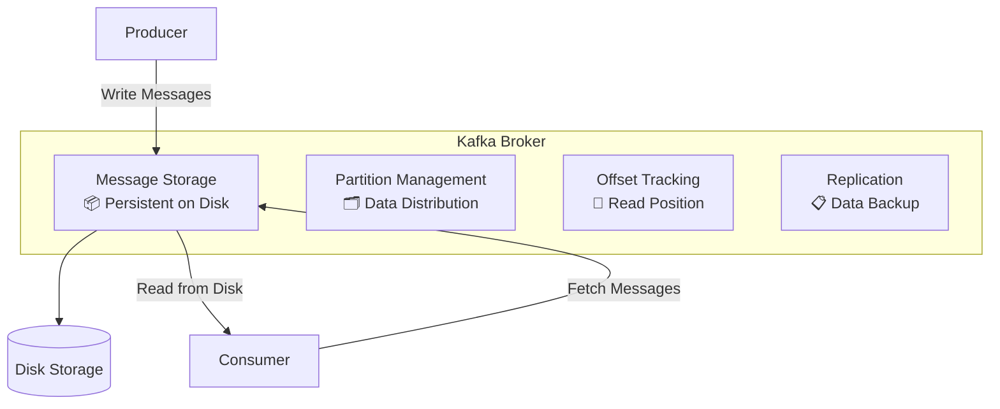
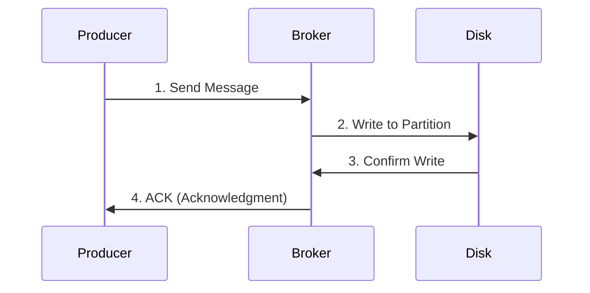
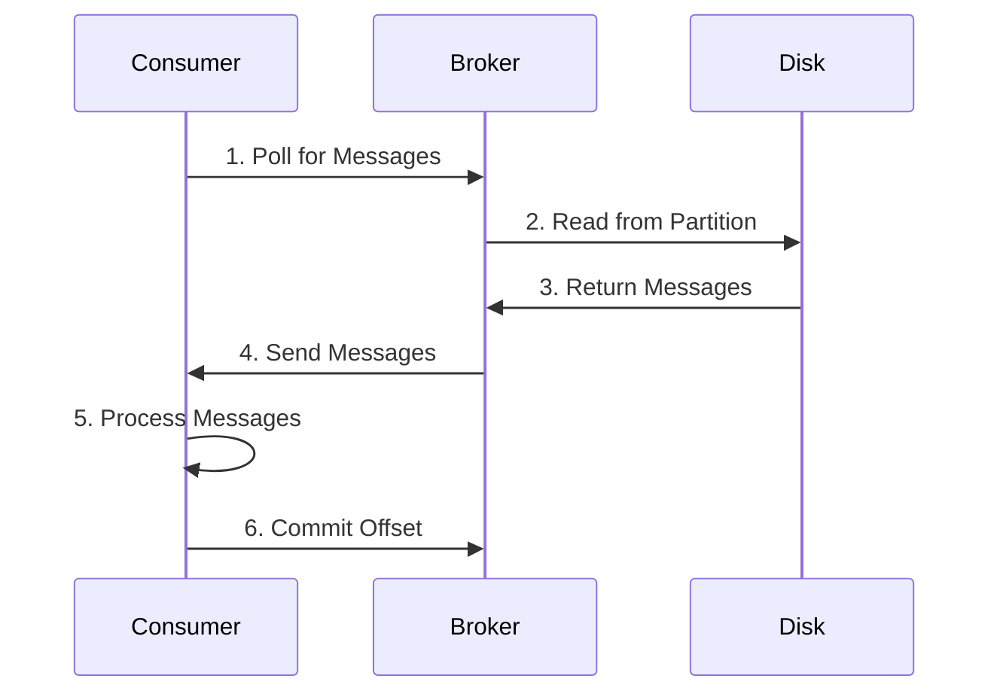
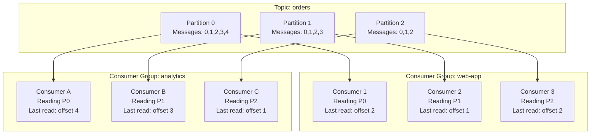
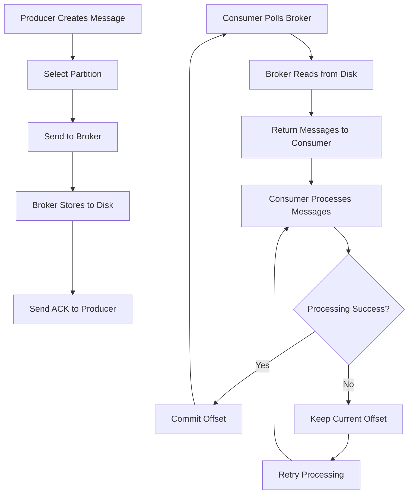
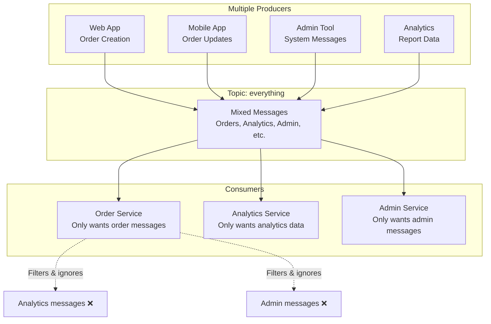
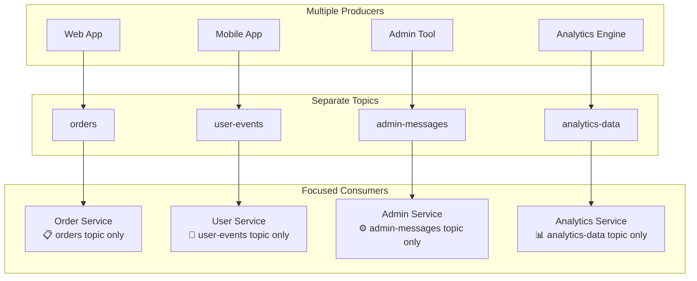
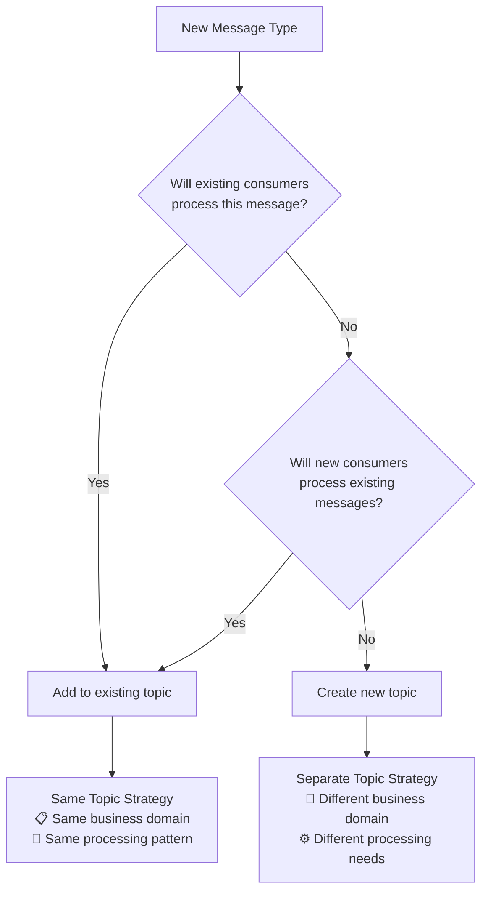

# Kafka Core Concepts

## Overview
This document explains the fundamental concepts of Apache Kafka including brokers, topics, partitions, producers, consumers, and offset management.

## 🏗️ Core Components

### 🏢 Broker
**What it is**: A Kafka server that stores and manages messages



**Key Responsibilities**:
- **Message Storage**: Persist messages to disk for durability
- **Partition Management**: Distribute data across partitions
- **Offset Management**: Track consumer read positions
- **Replication**: Maintain data copies (in multi-broker setup)

### 📝 Topic
**What it is**: A logical category/channel for messages

```
Topic: "user-events"
├── User login messages
├── User logout messages
└── User profile update messages
```

### 🗂️ Partition
**What it is**: Physical division of a topic for scalability

```
Topic: orders
├── Partition 0: [order1][order4][order7]
├── Partition 1: [order2][order5][order8]  
└── Partition 2: [order3][order6][order9]
```

**Benefits**:
- **Parallel Processing**: Multiple consumers can read different partitions
- **Scalability**: Add more partitions as data grows
- **Ordering**: Messages within a partition maintain order

## 📤 Producer Behavior

### Message Flow


### Key Points
- **Synchronous ACK**: Producer waits for confirmation
- **Partition Assignment**: Messages distributed across partitions
- **Durability**: Messages persisted to disk before ACK

## 📥 Consumer Behavior

### ❌ Common Misconception
> "Broker pushes messages to consumers"

### ✅ Actual Behavior: Pull-Based


**Why Pull-Based?**
- **Consumer Control**: Process at their own pace
- **Backpressure**: Prevent overwhelming slow consumers
- **Flexibility**: Batch size and frequency control

## 📍 Offset Management

### What is an Offset?
**Offset = Position number of a message within a partition**

```
Topic: my-topic
Partition 0: [msg0][msg1][msg2][msg3][msg4]
             ↑     ↑     ↑     ↑     ↑
Offset:      0     1     2     3     4
```

### Management Granularity
**❌ Not managed per topic**  
**✅ Managed per Consumer Group + Partition**



### Offset Storage Example
```yaml
# Kafka stores this information:
Consumer Group: "web-app"
├── orders-partition-0: offset 2  # Next read: offset 3
├── orders-partition-1: offset 1  # Next read: offset 2
└── orders-partition-2: offset 2  # Next read: offset 3

Consumer Group: "analytics"  
├── orders-partition-0: offset 4  # Next read: offset 5
├── orders-partition-1: offset 3  # Next read: offset 4
└── orders-partition-2: offset 1  # Next read: offset 2
```

## 👥 Consumer Groups

### Purpose
- **Load Distribution**: Multiple consumers share partition reading
- **Independent Processing**: Different groups can process same data
- **Fault Tolerance**: If one consumer fails, others take over

### Partition Assignment
```
Topic: user-events (3 partitions)
Consumer Group: notifications (2 consumers)

Assignment:
├── Consumer 1: Partition 0, Partition 1
└── Consumer 2: Partition 2

If Consumer 1 fails:
└── Consumer 2: Partition 0, Partition 1, Partition 2
```

## 🔄 Message Processing Flow

### Complete Lifecycle


## 🎯 Message Filtering and Topic Design

### The "Irrelevant Messages" Problem

**Common Scenario**: Multiple producers sending different types of messages


**Problem**: Consumers receive ALL messages and must filter out irrelevant ones.

### ❌ Anti-Pattern: Consumer-Side Filtering
```java
// Order Service has to process everything
@KafkaListener(topics = "everything")
public void processMessage(String message) {
    if (message.type.equals("ORDER_CREATED") || 
        message.type.equals("ORDER_UPDATED")) {
        // Process order message
        handleOrder(message);
    } else {
        // Ignore analytics, admin, etc. messages
        // ❌ Wasteful - received unnecessary data
    }
}
```

### ✅ Best Practice: Topic Separation


### 🏆 The Golden Rule of Topic Design

> **If different consumers will process the messages → Separate topics**  
> **If the same consumers will process the messages → Same topic**

#### ✅ Examples of Correct Same-Topic Design
```
Topic: orders (same consumers process all)
├── order-created, order-updated, order-cancelled
├── All processed by: Order Service, Inventory Service, Analytics
└── Same data, different purposes ✅

Topic: user-events (same consumers process all)  
├── user-registered, user-updated, user-deleted
├── All processed by: User Service, Notification Service, Analytics
└── Same data, different purposes ✅
```

#### ❌ Examples When to Split Topics
```
❌ Topic: business-events
├── orders, inventory, users, payments mixed
├── Order Service only wants orders
├── Payment Service only wants payments
└── Forces unnecessary filtering

✅ Split into:
├── Topic: orders → Order Service
├── Topic: inventory → Inventory Service  
├── Topic: users → User Service
└── Topic: payments → Payment Service
```

#### 🤔 Gray Area Examples
```
Could be same topic OR separate - depends on consumers:

Option 1: Fine-grained topics
├── order-created → Order Processing Service
├── order-shipped → Logistics Service  
├── order-cancelled → Refund Service
└── Different consumers → Separate topics ✅

Option 2: Coarse-grained topic  
├── orders (all events) → Order Management System
├── Same consumer handles all types
└── Same consumer → Same topic ✅
```

### 🎯 Decision Framework



#### **Questions to Ask:**
1. **Consumer Overlap**: Do the same services need to process these messages?
2. **Business Domain**: Are these messages part of the same business process?
3. **Processing Pattern**: Do they require similar handling logic?
4. **Scaling Needs**: Do they have different throughput requirements?

### Alternative Solutions

#### 1. **Partition Key Based Routing**
```java
// Producer side - route by message type
producer.send(new ProducerRecord<>(
    "mixed-topic",
    "order-events",  // partition key
    orderMessage
));

producer.send(new ProducerRecord<>(
    "mixed-topic", 
    "analytics",     // different partition key
    analyticsMessage
));
```

#### 2. **Consumer Subscription by Partition**
```java
// Order Service subscribes only to "order-events" partitions
consumer.assign(Arrays.asList(
    new TopicPartition("mixed-topic", 0),  // order-events partition
    new TopicPartition("mixed-topic", 1)   // order-events partition
));
```

#### 3. **Message Type with Filtering** (Less Efficient)
```java
@KafkaListener(topics = "orders")
public void processOrder(OrderMessage message) {
    switch(message.getType()) {
        case ORDER_CREATED:
            handleOrderCreation(message);
            break;
        case ORDER_CANCELLED:
            handleOrderCancellation(message);
            break;
        case ORDER_ANALYTICS:  // Still order-related
            // Different consumer group should handle this
            break;
    }
}
```

### 🎯 Design Principles

#### **"Send Only Relevant Messages"**
- **Topic Design**: Group related messages together
- **Producer Responsibility**: Send to appropriate topics
- **Consumer Simplicity**: Process everything received

#### **Topic Granularity Guidelines**
```
✅ Good Topic Design (by business domain):
├── orders (order-created, order-updated, order-cancelled)
├── inventory (stock-added, stock-reduced, stock-adjusted)
├── users (user-registered, user-updated, user-deleted)
└── payments (payment-initiated, payment-completed, payment-failed)

❌ Poor Topic Design (mixed domains):
├── everything
├── mixed-events
└── all-business-data

🤔 Context-Dependent (depends on consumers):
├── order-created (fine if only Order Service processes)
├── order-updated (fine if only Order Service processes)  
├── order-cancelled (fine if only Order Service processes)
└── OR orders (fine if same services process all types)
```

#### **When to Use Filtering**
- **Sub-types within same domain**: Order types (premium, standard, bulk)
- **Temporary migration**: Gradually splitting monolithic topics
- **Legacy system integration**: Cannot change existing producers

### 🚀 Best Practices Summary

1. **Design topics by business domain**, not technical boundaries
2. **Keep related message types together** if same consumers process them
3. **Separate unrelated concerns** into different topics
4. **Apply the golden rule**: Same consumers → Same topic, Different consumers → Different topics
5. **Use partition keys** for ordered processing within message types
6. **Avoid consumer-side filtering** when possible
7. **Think about consumer needs** when designing topics

**Remember**: Consumers process ALL messages from their assigned partitions. Design your topics so that "ALL messages" are "relevant messages"! 🎯

## ⚠️ Error Handling

### Producer Errors
- **Network Issues**: Retry with backoff
- **Broker Full**: Wait and retry
- **Serialization Error**: Fix message format

### Consumer Errors
- **Processing Failure**: Don't commit offset → retry same message
- **Deserialization Error**: Skip message or dead letter queue
- **Consumer Lag**: Scale up consumer instances

### Key Principle
**Kafka doesn't delete messages on consumer errors**
- Messages remain available for retry
- Offset controls what gets processed
- Multiple consumer groups can process same data independently

## 🎯 Practical Examples

### E-commerce Order Processing
```
Topic: orders (contains all order-related messages)
├── Partition 0: [order1][order4][order7][order10]
├── Partition 1: [order2][order5][order8][order11]  
└── Partition 2: [order3][order6][order9][order12]

Consumer Group: order-processing
├── Consumer 1: Processes P0 → sends to order service
├── Consumer 2: Processes P1 → sends to order service
└── Consumer 3: Processes P2 → sends to order service

Consumer Group: inventory-updates
├── Consumer A: Processes P0 → updates inventory
├── Consumer B: Processes P1 → updates inventory
└── Consumer C: Processes P2 → updates inventory

Consumer Group: analytics
├── Consumer X: Processes all partitions → generates reports
└── Different offsets, independent processing
```

**Key Point**: Each consumer group processes the same order messages but for different purposes:
- **order-processing**: Fulfills orders
- **inventory-updates**: Updates stock levels  
- **analytics**: Generates business reports

**Why same topic works**: All three consumer groups want to process ALL order messages, just for different business purposes.

### Message Replay Scenario
```bash
# Reset consumer group offset to replay messages
kafka-consumer-groups --bootstrap-server localhost:9092 \
  --group analytics \
  --topic orders \
  --reset-offsets \
  --to-earliest \
  --execute
```

## 🚀 Best Practices

### Producer
- **Use appropriate partition key** for message ordering
- **Configure proper ACK level** for durability vs performance
- **Handle failures gracefully** with retries
- **Send to appropriate topics** to minimize consumer filtering

### Consumer
- **Process messages idempotently** (handle duplicates)
- **Commit offsets only after successful processing**
- **Monitor consumer lag** for performance issues
- **Subscribe to relevant topics only**

### Topic Design
- **Choose partition count** based on parallelism needs
- **Set appropriate retention** for storage vs replay requirements
- **Design message keys** for even partition distribution
- **Group related messages** in same topic
- **Separate unrelated concerns** into different topics
- **Apply the golden rule**: Same consumers → Same topic, Different consumers → Different topics

---
*Understanding these concepts is crucial for building reliable, scalable applications with Kafka! 🎉*