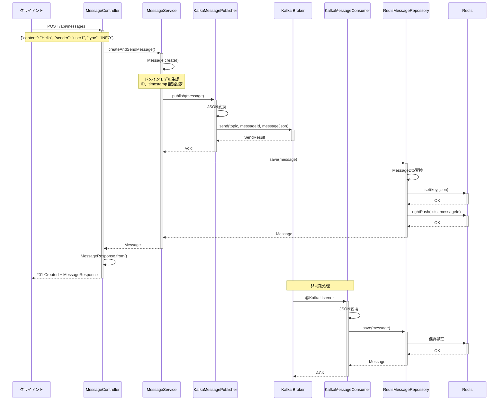
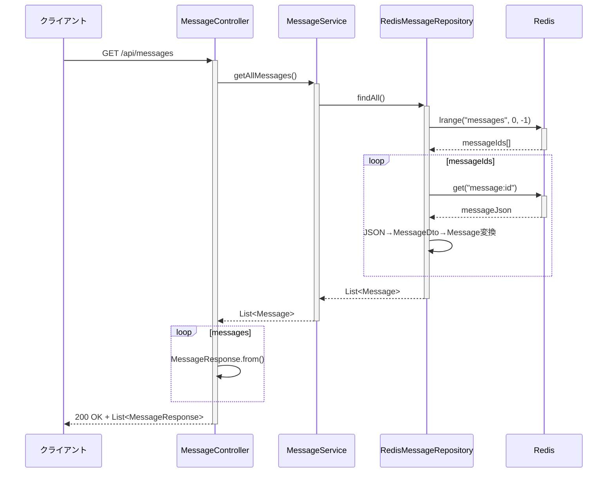
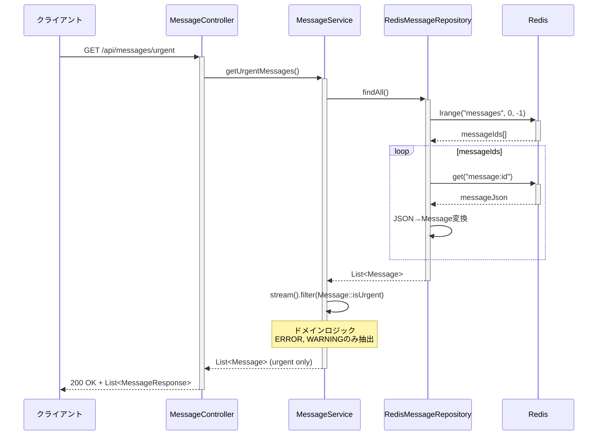
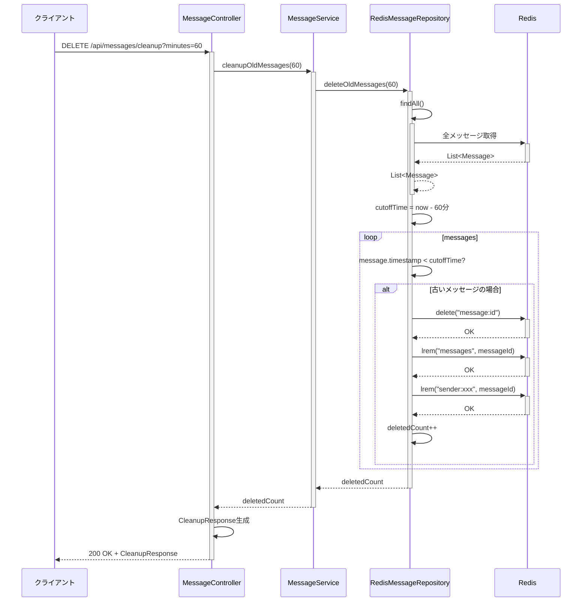
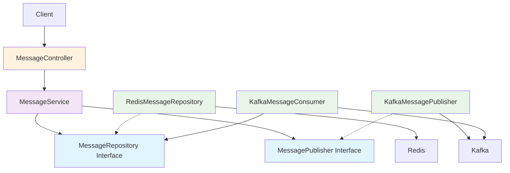

# Sequence Diagrams

このドキュメントでは、Spring Bootアプリケーションの主要なフローをシーケンス図で説明します。

## メッセージ作成フロー



## メッセージ取得フロー



## 緊急メッセージ取得フロー



## 古いメッセージ削除フロー



## エラーハンドリングフロー

```mermaid
sequenceDiagram
    participant Client as クライアント
    participant Controller as MessageController
    participant Service as MessageService
    participant Publisher as KafkaMessagePublisher
    participant Kafka as Kafka Broker
    participant Consumer as KafkaMessageConsumer

    Client->>+Controller: POST /api/messages (不正データ)
    Controller->>Controller: @Valid検証
    
    alt バリデーションエラー
        Controller-->>Client: 400 Bad Request
    else バリデーション成功
        Controller->>+Service: createAndSendMessage()
        Service->>+Publisher: publish(message)
        Publisher->>+Kafka: send()
        
        alt Kafka送信失敗
            Kafka-->>-Publisher: Exception
            Publisher->>Publisher: ログ出力
            Publisher-->>Service: RuntimeException
            Service-->>Controller: RuntimeException
            Controller-->>-Client: 500 Internal Server Error
        else Kafka送信成功
            Kafka-->>-Publisher: Success
            Publisher-->>-Service: void
            Service-->>-Controller: Message
            Controller-->>-Client: 201 Created
        end
    end
    
    Note over Consumer: 非同期エラー処理
    Kafka->>+Consumer: 不正なメッセージ
    Consumer->>Consumer: JSON変換失敗
    Consumer->>Consumer: ログ出力
    Note over Consumer: DLQ送信<br/>（将来実装予定）
    Consumer-->>-Kafka: NACK
```

## 依存関係とアーキテクチャ



## 開発・テスト用コマンド

### Gradleタスク実行例

```bash
# アプリケーション起動
./gradlew bootRun

# 開発用設定でアプリケーション起動
./gradlew runApp

# テスト実行
./gradlew test

# JARビルド
./gradlew bootJar

# 依存関係確認
./gradlew dependencies

# 特定の依存関係詳細
./gradlew dependencyInsight --dependency spring-kafka
```

### API テスト例

```bash
# アプリケーション起動後
curl -X POST http://localhost:8080/api/messages \
  -H "Content-Type: application/json" \
  -d '{"content": "Test message", "sender": "developer", "type": "INFO"}'

# メッセージ確認
curl http://localhost:8080/api/messages
```

## 注記

### アーキテクチャの特徴
- **依存関係の方向**: 外層から内層への一方向
- **ドメイン層の独立性**: `Message`クラスは外部技術に依存しない
- **インターフェース分離**: `MessageRepository`と`MessagePublisher`でインフラ層を抽象化

### 非同期処理
- Kafkaへの送信は同期的だが、受信処理は非同期
- メッセージの二重保存を避けるため、Redisでの重複チェックが可能

### エラー処理
- バリデーションエラーは400番台で返却
- インフラエラーは500番台で返却
- Kafkaの非同期エラーはログ出力とDLQ（将来実装）で対応

### ビルドツール
- **Gradle 8.8**を使用
- **Java 21**対応
- **Spring Boot 3.3.2**との統合
- パフォーマンス最適化設定済み（`gradle.properties`）
