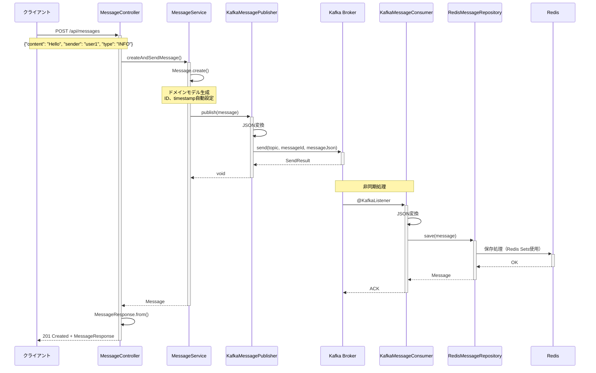
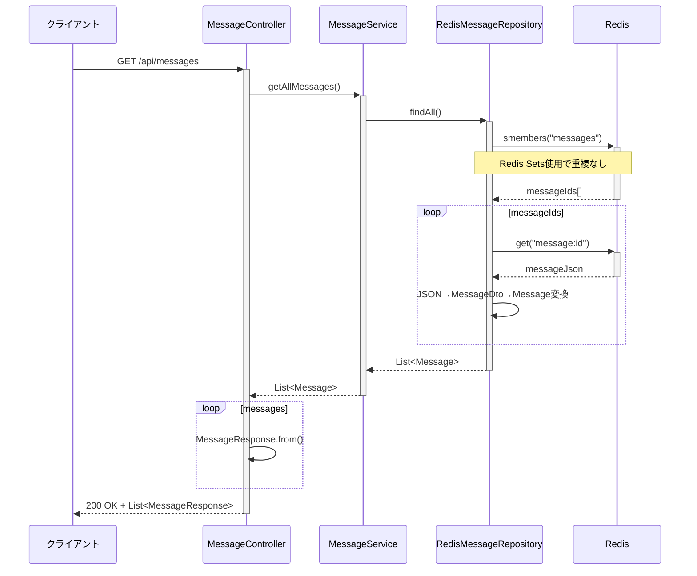
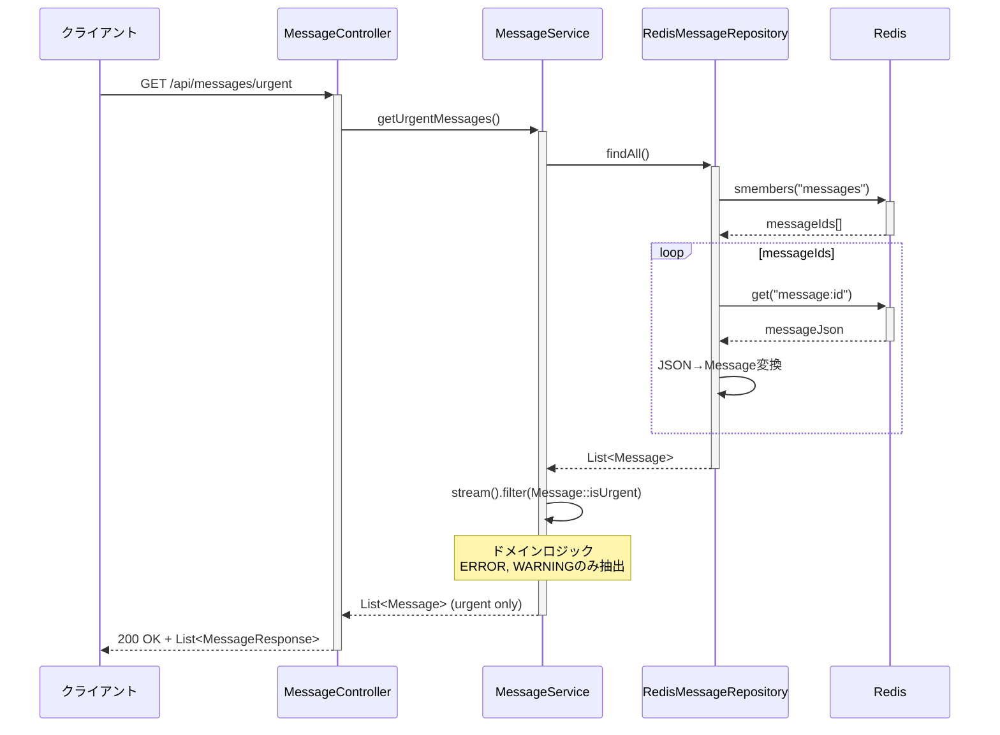
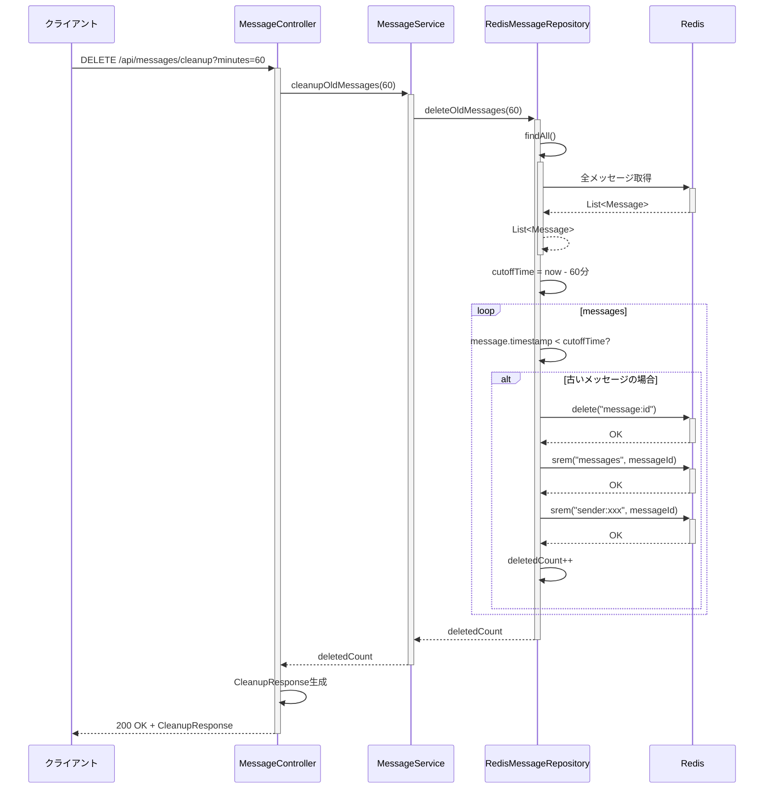
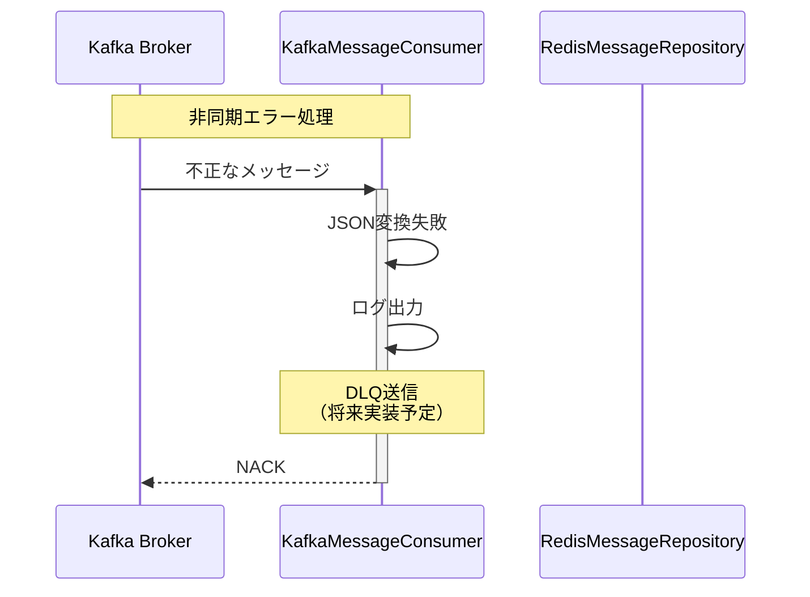
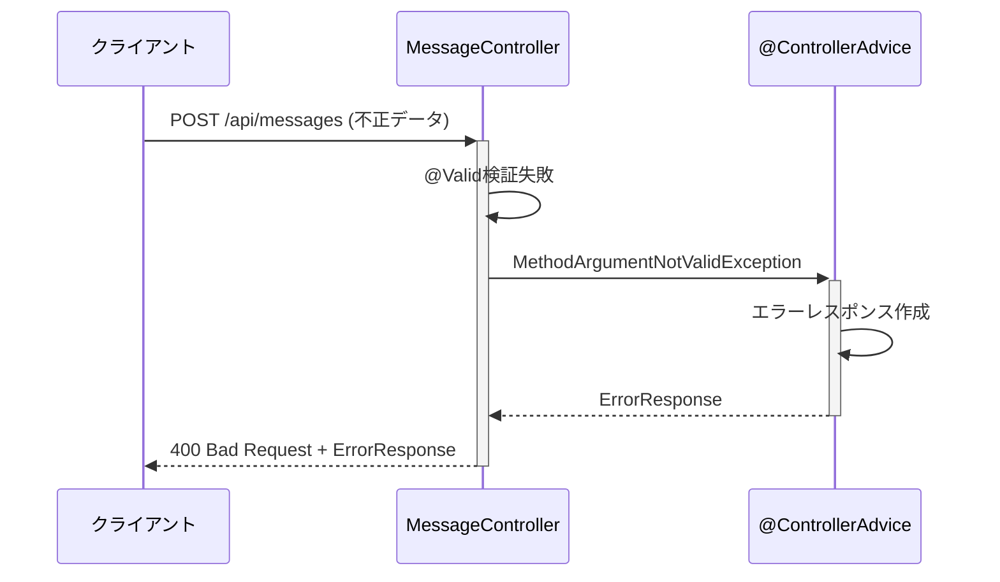
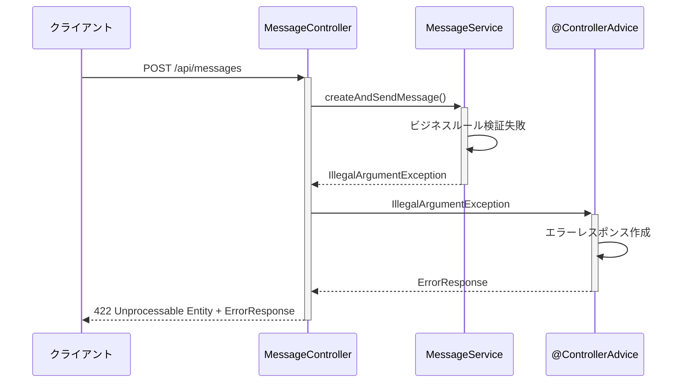
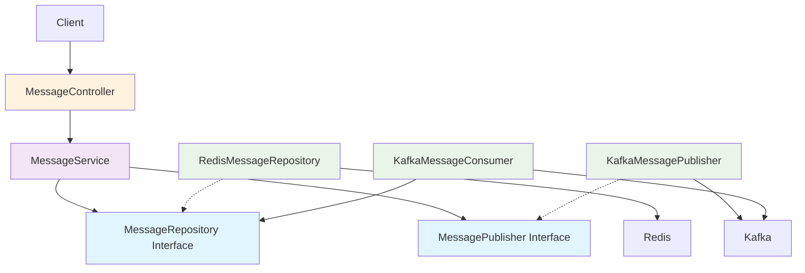

# Sequence Diagrams

このドキュメントでは、Spring Bootアプリケーションの主要なフローをシーケンス図で説明します。

## メッセージ作成フロー



## メッセージ取得フロー



## 緊急メッセージ取得フロー



## 古いメッセージ削除フロー



## エラーハンドリングフロー

```mermaid
sequenceDiagram
    participant Client as クライアント
    participant Controller as MessageController
    participant Service as MessageService
    participant Publisher as KafkaMessagePublisher
    participant Kafka as Kafka Broker

    Client->>+Controller: POST /api/messages (不正データ)
    Controller->>Controller: @Valid検証
    
    alt バリデーションエラー
        Controller-->>-Client: 400 Bad Request
    else バリデーション成功
        Controller->>+Service: createAndSendMessage()
        Service->>+Publisher: publish(message)
        Publisher->>+Kafka: send()
        
        alt Kafka送信失敗
            Kafka-->>-Publisher: Exception
            Publisher->>Publisher: ログ出力
            Publisher-->>-Service: RuntimeException
            Service-->>-Controller: RuntimeException
            Controller-->>-Client: 500 Internal Server Error
        else Kafka送信成功
            Kafka-->>-Publisher: Success
            Publisher-->>-Service: void
            Service-->>-Controller: Message
            Controller-->>-Client: 201 Created
        end
    end
```

## 非同期Consumer エラーフロー



## Redisエラーハンドリングフロー

```mermaid
sequenceDiagram
    participant Client as クライアント
    participant Controller as MessageController
    participant Service as MessageService
    participant Repository as RedisMessageRepository
    participant Redis as Redis

    Client->>+Controller: GET /api/messages
    Controller->>+Service: getAllMessages()
    Service->>+Repository: findAll()
    
    alt Redis接続成功
        Repository->>+Redis: smembers("messages")
        Redis-->>-Repository: messageIds[]
        
        loop messageIds
            Repository->>+Redis: get("message:id")
            alt データ取得成功
                Redis-->>-Repository: messageJson
            else データ取得失敗
                Redis-->>-Repository: null
                Repository->>Repository: ログ出力（警告）
            end
        end
        
        Repository-->>-Service: List<Message>
        Service-->>-Controller: List<Message>
        Controller-->>-Client: 200 OK + List<MessageResponse>
        
    else Redis接続失敗
        Repository->>+Redis: smembers("messages")
        Redis-->>-Repository: ConnectionException
        Repository->>Repository: ログ出力（エラー）
        Repository-->>-Service: RedisConnectionException
        Service-->>-Controller: RedisConnectionException
        Controller-->>-Client: 503 Service Unavailable
    end
```

## バリデーションエラーフロー



## ビジネスロジックエラーフロー



## 依存関係とアーキテクチャ



## 開発・テスト用コマンド

### Docker環境での開発

```bash
# 完全な環境起動
docker-compose --profile local-infra up --build -d

# アプリケーションのみ再ビルド
docker-compose build app
docker-compose restart app

# ログ確認
docker-compose logs -f app

# テスト実行（コンテナ内）
docker-compose exec app ./gradlew test

# JARビルド
docker-compose exec app ./gradlew bootJar

# 依存関係確認
docker-compose exec app ./gradlew dependencies

# 特定の依存関係詳細
docker-compose exec app ./gradlew dependencyInsight --dependency spring-kafka
```

### API テスト例

```bash
# アプリケーション起動後
curl -X POST http://localhost:8888/api/messages \
  -H "Content-Type: application/json" \
  -d '{"content": "Test message", "sender": "developer", "type": "INFO"}'

# メッセージ確認
curl http://localhost:8888/api/messages
```

### CI/CD用コマンド

```bash
# GitHub Actions等のCI環境で
docker build -t kafka-redis-playground .
docker run --rm kafka-redis-playground ./gradlew test jacocoTestReport

# またはdocker-composeでテスト
docker-compose run --rm app ./gradlew test jacocoTestReport
```

## 注記

### アーキテクチャの特徴
- **依存関係の方向**: 外層から内層への一方向
- **ドメイン層の独立性**: `Message`クラスは外部技術に依存しない
- **インターフェース分離**: `MessageRepository`と`MessagePublisher`でインフラ層を抽象化

### 非同期処理とデータ整合性
- **単一保存**: Publisherは送信のみ、Consumerが保存を担当
- **Redis Sets使用**: 重複メッセージIDを自動で排除
- **観察可能**: 3秒遅延でKafka処理フローを可視化

### エラー処理
- **バリデーションエラー**: 400 Bad Request
- **ビジネスロジックエラー**: 422 Unprocessable Entity
- **Kafkaエラー**: 500 Internal Server Error
- **Redisエラー**: 503 Service Unavailable

### エラーハンドリング修正点
- **パーティシパント管理**: 非アクティブエラーを完全修正
- **フロー分離**: 各エラータイプを独立したフローに分離
- **統一的処理**: `@ControllerAdvice`によるグローバルエラーハンドリング

### 技術スタック
- **Amazon Corretto 21** - 企業グレードJava環境
- **Spring Boot 3.5.4** - 最新フレームワーク
- **Gradle 8.10.2** - モダンビルドツール
- **完全Docker化** - ローカル開発からプロダクションまで