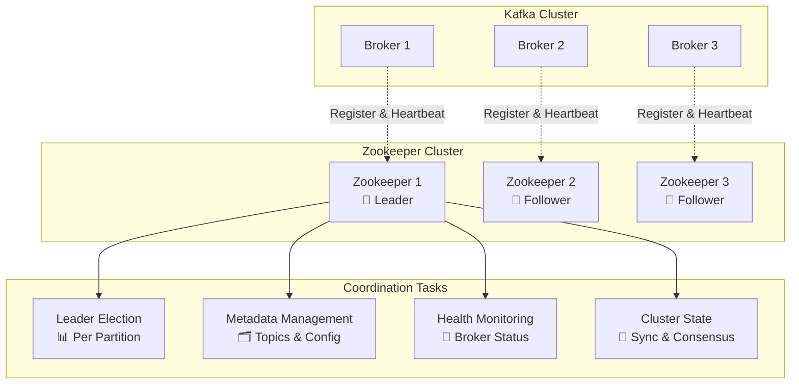
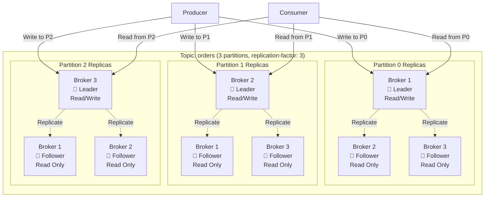
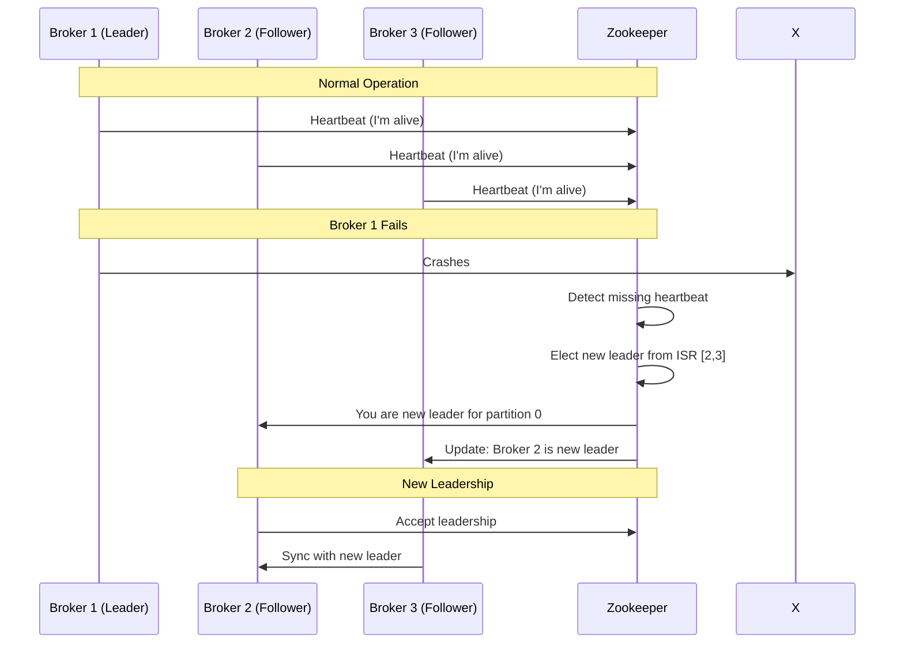
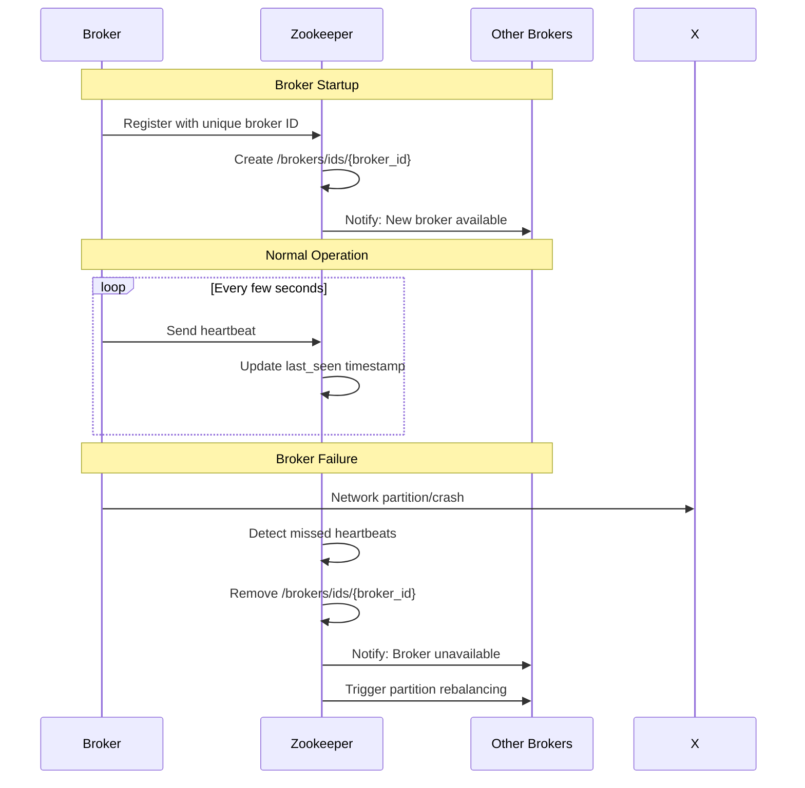
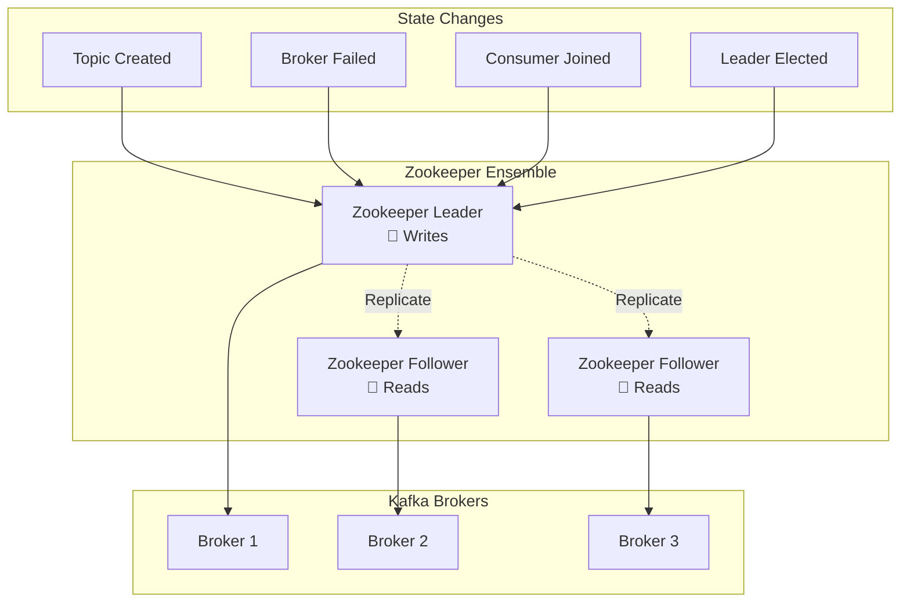
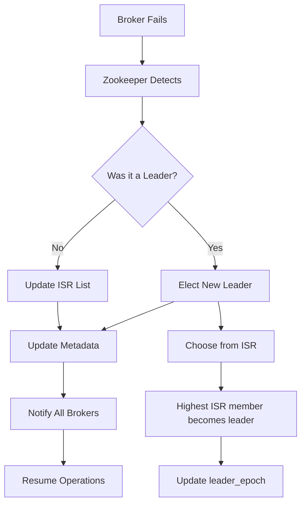
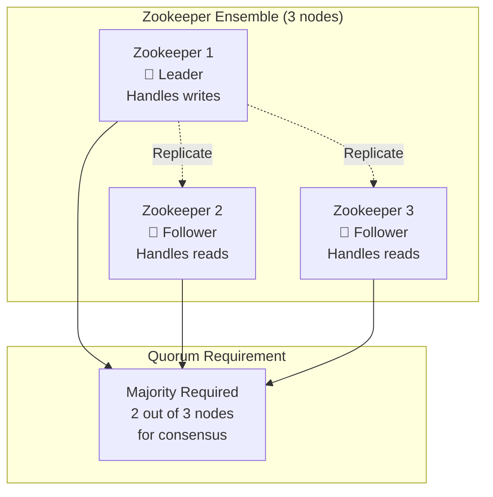

# Zookeeper Deep Dive

## Overview
This document explains Apache Zookeeper's critical role in Kafka cluster management, including leader election, metadata coordination, and cluster state management.

## 🎯 What is Zookeeper?

**Zookeeper = Distributed Coordination Service**
- **Not a message broker** - It's a coordination layer
- **Cluster orchestrator** - Manages distributed system coordination
- **Consensus keeper** - Ensures all nodes agree on cluster state
- **Metadata store** - Centralized configuration and state storage



## 🏗️ Kafka Cluster Architecture

### **Cluster vs Single Broker**

#### ❌ **Current Setup (Single Broker)**
```yaml
# docker-compose.yml
kafka:
  environment:
    KAFKA_BROKER_ID: 1  # Only one broker
    
# Result: No fault tolerance, no replication
```

#### ✅ **Production Cluster (Multiple Brokers)**
```yaml
# 3-Broker Cluster Example
kafka1:
  environment:
    KAFKA_BROKER_ID: 1
    
kafka2:
  environment:
    KAFKA_BROKER_ID: 2
    
kafka3:
  environment:
    KAFKA_BROKER_ID: 3
```

### **Partition Leadership Distribution**

**Key Concept**: There's **NO global leader broker**. Leadership is **per-partition**.



## 🎭 Zookeeper's Core Responsibilities

### **1. 📊 Leader Election**

**Per-Partition Leadership Management**

```yaml
# Zookeeper stores partition leadership info
/brokers/topics/orders/partitions/0/state:
  leader: 1           # Broker 1 is leader for partition 0
  leader_epoch: 5     # Leadership generation number
  isr: [1, 2, 3]      # In-Sync Replicas (healthy followers)
  
/brokers/topics/orders/partitions/1/state:
  leader: 2           # Broker 2 is leader for partition 1
  leader_epoch: 3
  isr: [1, 2, 3]
  
/brokers/topics/orders/partitions/2/state:
  leader: 3           # Broker 3 is leader for partition 2  
  leader_epoch: 7
  isr: [1, 2, 3]
```

#### **Leader Election Process**


### **2. 🗂️ Metadata Management**

**Centralized Configuration Storage**

```yaml
# Topic Configurations
/config/topics/orders:
  partitions: 3
  replication-factor: 3
  retention.ms: 604800000    # 7 days
  cleanup.policy: delete
  max.message.bytes: 1000000

# Broker Registrations  
/brokers/ids/1:
  host: kafka1.example.com
  port: 9092
  timestamp: 1634567890123
  
/brokers/ids/2:
  host: kafka2.example.com
  port: 9092
  timestamp: 1634567890124
  
/brokers/ids/3:
  host: kafka3.example.com
  port: 9092
  timestamp: 1634567890125

# Consumer Group Information
/consumers/web-app/offsets/orders/0: 1250  # Partition 0 offset
/consumers/web-app/offsets/orders/1: 890   # Partition 1 offset
/consumers/web-app/offsets/orders/2: 1100  # Partition 2 offset
```

### **3. 💓 Health Monitoring**

**Broker Lifecycle Management**



### **4. 🔄 Cluster State Synchronization**

**Ensuring Consistency Across Brokers**



## 🚨 Failure Scenarios and Recovery

### **Broker Failure Recovery**



#### **Example: Partition Leader Failover**
```yaml
# Before failure:
Partition 0: Leader=Broker1, ISR=[1,2,3]

# Broker 1 fails:
Zookeeper detects → Missing heartbeats
Zookeeper actions:
├── Remove Broker 1 from ISR
├── Elect Broker 2 as new leader  
├── Update leader_epoch: 5 → 6
└── Notify all brokers

# After recovery:
Partition 0: Leader=Broker2, ISR=[2,3]

# When Broker 1 returns:
├── Rejoins as follower
├── Syncs data from current leader
└── Added back to ISR: [1,2,3]
```

### **Zookeeper Itself (High Availability)**

**Zookeeper Ensemble for Fault Tolerance**



**Zookeeper Failure Scenarios:**
```yaml
3-node ensemble:
├── 1 node fails: ✅ Cluster continues (2/3 majority)
├── 2 nodes fail: ❌ Cluster stops (1/3 minority)
└── Best practice: Use odd numbers (3, 5, 7)

5-node ensemble:
├── 1-2 nodes fail: ✅ Cluster continues (3/5 majority)
├── 3+ nodes fail: ❌ Cluster stops
└── Higher availability but more overhead
```

## ⚙️ Environment Variables Explained

### **Zookeeper Configuration**
```yaml
# From docker-compose.yml
ZOOKEEPER_CLIENT_PORT: 2181
# Purpose: Port where Kafka brokers connect to Zookeeper
# Default: 2181 (standard Zookeeper port)

ZOOKEEPER_TICK_TIME: 2000  
# Purpose: Basic time unit (milliseconds) for heartbeats
# Default: 2000ms = 2 seconds
# Usage: Session timeouts are multiples of tick time
```

### **Kafka-Zookeeper Integration**
```yaml
# From docker-compose.yml
KAFKA_ZOOKEEPER_CONNECT: 'zookeeper:2181'
# Purpose: How Kafka finds Zookeeper
# Format: host:port[/path]
# Cluster example: 'zk1:2181,zk2:2181,zk3:2181/kafka'

KAFKA_BROKER_ID: 1
# Purpose: Unique identifier for this broker in the cluster
# Important: Must be unique across all brokers
# Range: Any positive integer
```

## 🎯 Practical Examples

### **Single Broker vs Cluster Comparison**

#### **Current Setup (Development)**
```yaml
# Single broker - No fault tolerance
Kafka Cluster: 1 broker
Replication Factor: 1 (no replicas)
Partition Leaders: All on Broker 1
Failure Impact: Complete service outage

Topics created with:
--replication-factor 1  # No backup copies
--partitions 3          # All leaders on same broker
```

#### **Production Cluster**
```yaml
# 3-broker cluster - Fault tolerant  
Kafka Cluster: 3 brokers
Replication Factor: 3 (2 backup copies)
Partition Leaders: Distributed across brokers
Failure Impact: Automatic failover, no downtime

Topics created with:
--replication-factor 3  # 2 backup copies per partition
--partitions 9          # Leaders distributed evenly
```

### **Scaling Example**
```yaml
# Starting with 3 brokers
Topic: orders
├── Partition 0: Leader=Broker1, Replicas=[1,2,3]
├── Partition 1: Leader=Broker2, Replicas=[2,3,1]  
├── Partition 2: Leader=Broker3, Replicas=[3,1,2]
└── Even distribution ✅

# Adding Broker 4
Topic: orders (rebalanced)
├── Partition 0: Leader=Broker1, Replicas=[1,2,3]
├── Partition 1: Leader=Broker2, Replicas=[2,3,4]
├── Partition 2: Leader=Broker3, Replicas=[3,4,1]
├── Partition 3: Leader=Broker4, Replicas=[4,1,2]
└── New partitions get new broker ✅
```

## 🚀 Best Practices

### **Zookeeper Deployment**
- **Use odd numbers** of nodes (3, 5, 7) for quorum
- **Separate hardware** from Kafka brokers
- **Fast disks** for Zookeeper transaction logs
- **Stable network** between Zookeeper nodes

### **Kafka Cluster Design**
- **Start with 3 brokers** minimum for production
- **Replication factor ≥ 3** for critical topics
- **Monitor ISR** (In-Sync Replicas) health
- **Plan partition count** for future scaling

### **Monitoring Key Metrics**
```yaml
Zookeeper Health:
├── Node availability (all nodes up?)
├── Leader election frequency (should be rare)
├── Client connection count
└── Response latency

Kafka Cluster Health:
├── Broker availability
├── Under-replicated partitions (should be 0)
├── Leader election rate (should be low)
├── ISR shrink/expand events
└── Consumer lag per partition
```

## 🔮 Future: Kafka Without Zookeeper

**KRaft Mode (Kafka 2.8+)**
- **Self-managed metadata** - Kafka handles its own coordination
- **Simplified architecture** - No external Zookeeper dependency
- **Better scalability** - Faster metadata operations
- **Production ready** in Kafka 3.3+

```yaml
# Future architecture (KRaft)
kafka:
  environment:
    KAFKA_PROCESS_ROLES: 'broker,controller'  # Self-managed
    # No KAFKA_ZOOKEEPER_CONNECT needed!
```

---
*Understanding Zookeeper's role is crucial for designing reliable, scalable Kafka clusters! 🎉*